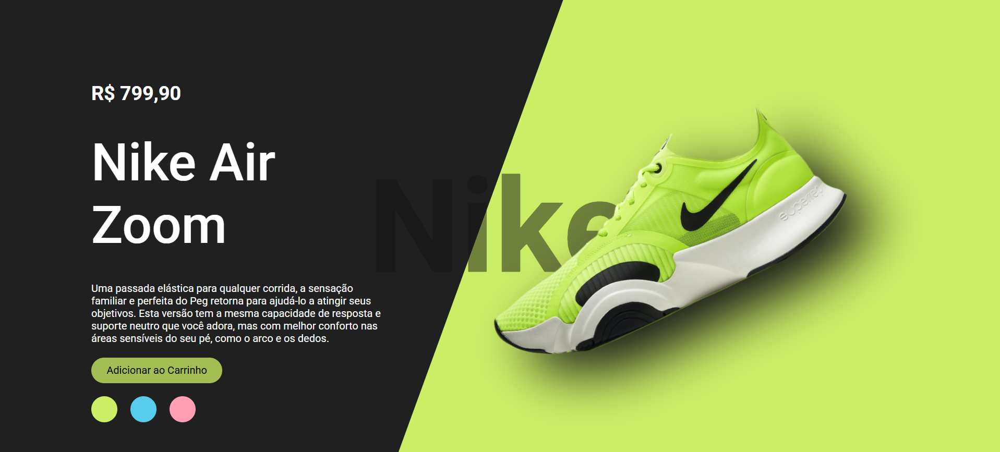
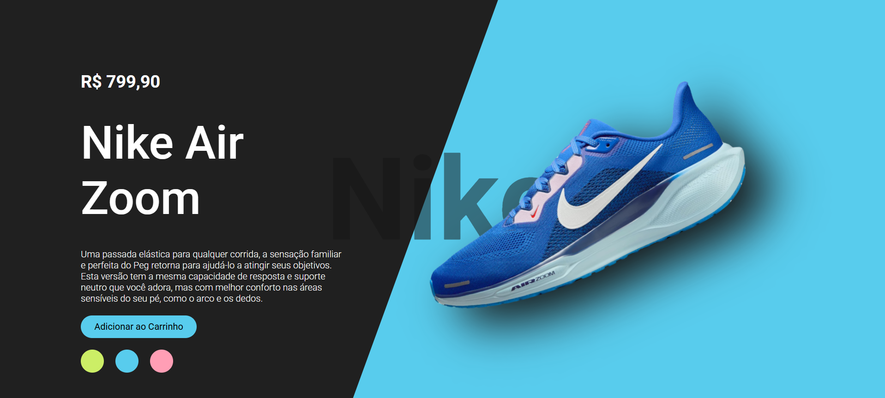
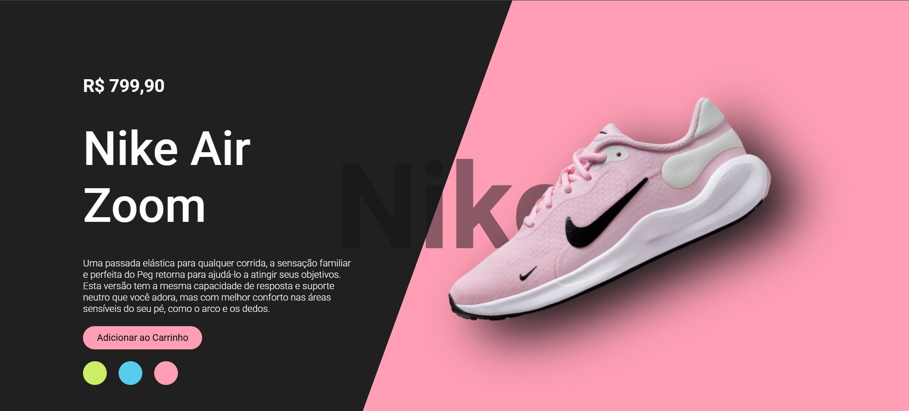

<h1>Nike Air Landing Page </h1>

Landing page interativa inspirada em um produto da Nike, desenvolvida com HTML, CSS e JavaScript.
O projeto simula uma vitrine digital de e-commerce, permitindo a troca dinâmica de cores e imagens do tênis, além de oferecer uma experiência moderna e envolvente ao usuário.

<h3>Tecnologias utilizadas:</h3>

• HTML5 → Estrutura semântica da página  
• CSS3 → Estilização, responsividade e efeitos visuais  
• JavaScript → Interatividade e animações  

<h3>Funcionalidades:</h3>

• Layout responsivo com design moderno  
• Animação suave na troca de imagens e cores  
• Efeito de hover e interação em botões  
• Simulação de botão “Adicionar ao Carrinho”  
• Background dinâmico que acompanha a cor do produto  

<h3>Aprendizados:</h3>

Esse projeto foi uma oportunidade para praticar:  
• Estruturação de layouts modernos em HTML/CSS  
• Criação de animações com transições suaves  
• Manipulação do DOM com JavaScript puro  
• Noções de UX e design de interfaces atrativas  

<h3>Demonstração</h3>

  
  
  

Feito com 💙 por [Débora Iarcheski](https://www.linkedin.com/in/debora-iarcheski/)
